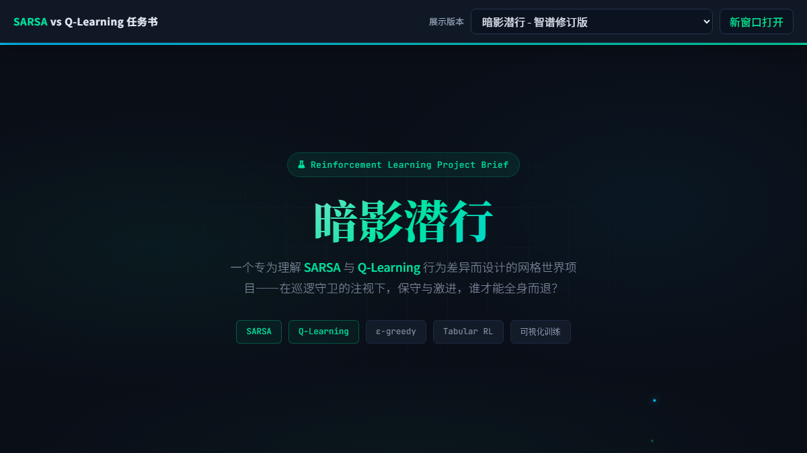

# 暗影潜行：表格型强化学习实验

这是一个带移动守卫的网格世界强化学习项目，用于研究和对比
SARSA（On-Policy）与 Q-Learning（Off-Policy）的策略差异。
需求由人提出，使用对比多个AI生成的任务书，选择了智谱版本作为最终任务

## 在线任务书

[点击进入可上下滑动、可切换版本的任务书展示页面](https://bengoooo.github.io/SARSA_QL_BreakThrough/)

[](https://bengoooo.github.io/SARSA_QL_BreakThrough/)

展示页面收录了智谱原版与修订版、Xiaomi MiMo 和 Qwen 生成的任务书。
页面顶部可以切换版本，正文区域支持鼠标滚轮和触屏上下滑动。

当前仓库已经实现：

- 可移动守卫、障碍物、终点与碰撞判定
- 离散状态编码和文本渲染
- 通用表格型智能体与 epsilon-greedy 策略
- Q-Learning 更新、训练与贪心策略评估
- 环境和智能体的基础检查脚本

SARSA、训练指标可视化及完整算法对比仍在后续开发范围内。详细设计见
[在线项目规划书](https://bengoooo.github.io/SARSA_QL_BreakThrough/)。

## 项目结构

```text
.
├── agents/
│   └── tabular_agent.py      # 表格型智能体与 Q 表操作
├── envs/
│   └── breakthrough_env.py   # 网格环境、守卫移动和奖励逻辑
├── docs/
│   ├── index.html            # 可滚动、可切换版本的 Pages 查看器
│   ├── prompts/              # 各模型生成的任务书 HTML
│   └── preview.png           # README 页面预览图
├── check_agent.py            # 智能体功能检查
├── check_env.py              # 环境功能检查
├── train_q_learning.py       # Q-Learning 训练入口
└── requirements.txt
```

## 环境要求

- Python 3.10+

建议使用独立虚拟环境：

```bash
python -m venv .venv
source .venv/bin/activate
python -m pip install -r requirements.txt
```

## 运行方式

检查环境：

```bash
python check_env.py
```

检查表格型智能体：

```bash
python check_agent.py
```

训练并评估 Q-Learning：

```bash
python train_q_learning.py
```

训练脚本默认运行 3000 个 episode，每 100 个 episode 输出平均奖励、成功率、
被捕率、超时率、epsilon 和 Q 表状态数，最后用贪心策略进行一次文本评估。

## 环境约定

- `H`：智能体
- `G`：守卫
- `T`：目标
- `#`：障碍物
- `.`：可通行区域
- `X`：智能体与守卫发生碰撞

动作空间包含上、下、左、右和原地不动，共 5 个离散动作。
